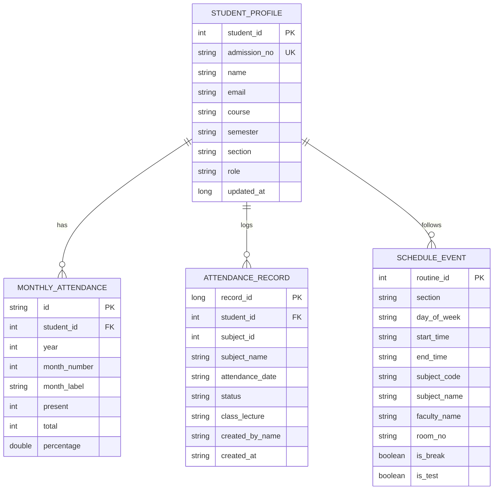

# Lloyd ERP Data Model Specification

This document defines the canonical entities, relationships, schema definitions, and validation rules for student attendance, timetable routines, and profile identity.

---

## 1. Domain Entities & Schemas

---

## 2. Entity Specifications

### 2.1 Student Profile (`UserProfile`)
| Field | Type | Nullable | Source | Description |
| :--- | :--- | :--- | :--- | :--- |
| `student_id` | Integer | No | `/auth/login` (`user.id` or `profile_id`) | Unique primary key identifying the student in Lloyd ERP. |
| `admission_no` | String | No | `/auth/login` (`user.admission_no`) | Official college admission number (e.g., `2023LLOYD1234`). |
| `name` | String | No | `/auth/login` (`user.name`) | Full legal name of the enrolled student. |
| `email` | String | Yes | `/auth/login` (`user.email`) | Student institutional or personal email address. |
| `course` | String | Yes | `/auth/login` (`user.course`) | Academic degree program (e.g., `B.Tech CSE`). |
| `semester` | String | Yes | `/auth/login` (`user.semester`) | Current active academic semester (e.g., `1st Semester`). |
| `section` | String | Yes | `/auth/login` (`user.section`) | Assigned classroom section (e.g., `A-1`). |

### 2.2 Attendance Record (`StudentAttendanceItem`)
| Field | Type | Nullable | Source | Description |
| :--- | :--- | :--- | :--- | :--- |
| `id` | Long | No | `/attendance/student` (`id`) | Unique ledger transaction ID generated when teacher submits attendance. |
| `student_id` | Integer | No | `/attendance/student` | Foreign key referencing the authenticated student. |
| `subject_id` | Integer | Yes | `/attendance/student` | Numerical identifier of the college subject. |
| `subject_name` | String | No | `/attendance/student` | Course title (e.g., `Applied Mathematics-I`). |
| `attendance_date` | String | No | `/attendance/student` | Date formatted as `YYYY-MM-DD`. |
| `status` | String | No | `/attendance/student` | `"Present"` or `"Absent"`. Case-insensitive validation required. |
| `class_lecture` | String | Yes | `/attendance/student` | Lecture period sequence number (e.g., `"1"`, `"2"`). |
| `created_by_name` | String | Yes | `/attendance/student` | Name of the faculty member who marked attendance. |
| `created_at` | String | Yes | `/attendance/student` | Server timestamp of the submission (`YYYY-MM-DD HH:MM:SS`). |

### 2.3 Monthly Summary (`MonthItem`)
| Field | Type | Description |
| :--- | :--- | :--- |
| `year` | Integer | Calendar year of the record (e.g., `2026`). |
| `month_number` | Integer | Month number (1 to 12). |
| `month_label` | String | Human readable month (e.g., `"Oct 2026"`). |
| `present` | Integer | Total classes attended in that month. |
| `total` | Integer | Total classes conducted in that month. |
| `percentage` | Double | Monthly attendance percentage: $\frac{\text{present}}{\text{total}} \times 100$. |

### 2.4 Calculated Attendance Aggregate (`CalculatedStats`)
Derived domain model synthesized from official monthly or log entries:
- `overall_percentage`: Total attended divided by total conducted $\times 100$, rounded to one decimal place.
- `total_present`: Sum of all attended lectures across all months.
- `total_absent`: Total classes minus total present.
- `total_classes`: Total classes conducted across all subjects.
- `bunk_allowance`: Maximum lectures that can be missed while maintaining $\ge 75.0\%$.
- `needed_to_reach_75`: Minimum consecutive lectures that must be attended to recover to $\ge 75.0\%$.
- `is_safe`: Boolean flag indicating if overall percentage $\ge 75.0\%$.
- `last_updated_millis`: Unix epoch timestamp when calculation occurred.

---

## 3. Data Integrity & Validation Invariants

1. **Percentage Boundaries**:
   $0.0\% \le \text{overall\_percentage} \le 100.0\%$. If $\text{total\_classes} = 0$, default percentage is defined as $100.0\%$.
2. **Attendance Conservation Law**:
   $\text{total\_classes} = \text{total\_present} + \text{total\_absent}$.
3. **Threshold Invariant**:
   $\text{is\_safe} = \text{true} \iff \text{overall\_percentage} \ge 75.0\%$.
4. **Mutual Exclusivity of Bunk vs Recovery**:
   - If $\text{is\_safe} = \text{true}$, then $\text{needed\_to\_reach\_75} = 0$ and $\text{bunk\_allowance} \ge 0$.
   - If $\text{is\_safe} = \text{false}$, then $\text{bunk\_allowance} = 0$ and $\text{needed\_to\_reach\_75} \ge 1$.
