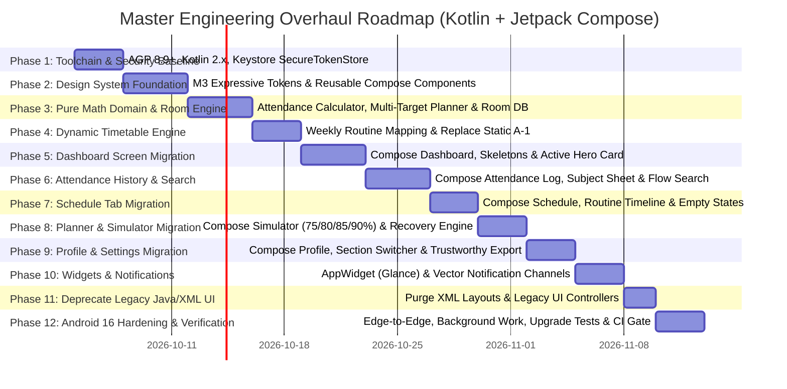

# Lloyd ERP Engineering Roadmap (Production Kotlin & Jetpack Compose Overhaul)

This roadmap outlines the phased transformation of the Lloyd Student application into an enterprise-grade, offline-first, real-data student operating system powered by **Kotlin** and **Jetpack Compose with Material Design 3 Expressive**.

---

## 12-Phase Master Schedule

---

## Phase Breakdown

### Phase 1: Toolchain & Security Baseline
- Upgrade build toolchain to AGP 8.9.x+ (supporting Android 16 / API 36), Kotlin 2.x, and official Kotlin Compose Compiler Gradle plugin (`org.jetbrains.kotlin.plugin.compose`).
- Establish `SecureTokenStore` backed by hardware-backed Android Keystore (AES-256-GCM).
- Permanently purge plaintext password persistence from all storage and models.
- Clean up XML placeholders with neutral indicators (`--.-%`, `--`, `--`) for continuous safe compilation.

### Phase 2: Core Design System (`core/designsystem/`)
- Implement `LloydTheme.kt`, `Color.kt`, `Typography.kt`, `Shapes.kt`, `Spacing.kt`, and `Motion.kt`.
- Build reusable M3 Expressive components:
  - `AttendanceCard.kt`
  - `ScheduleCard.kt`
  - `SubjectCard.kt`
  - `StatusBadge.kt`
  - `Timeline.kt`
  - `Skeleton.kt`
  - `EmptyState.kt`
  - `OfflineState.kt`
- Integrate Google Material Symbols vector assets (zero emojis).

### Phase 3: Domain Engine & Room Database
- Build pure Kotlin domain models:
  - `AttendanceSnapshot` (`NoData` vs `Recorded`)
  - `AttendanceThreshold` (multi-target parameter: 75%, 80%, 85%, 90%)
  - `AttendanceThresholdAnalysis`
  - `AttendanceCalculator.kt` (pure mathematical optimization)
  - `BunkAdvisor.kt` (human advisory policies)
  - `SimulationEngine.kt` (interactive scenario projections)
- Establish Room database, entities, DAOs, and reactive Kotlin `Flow` queries.
- Build comprehensive JUnit 4 boundary test suite (`AttendanceCalculatorTest.kt`).

### Phase 4: Dynamic Timetable Routine Engine
- Explicitly replace hardcoded Section A-1 in `TimetableRepository.java` with Room-backed `TimetableRepository.kt`.
- Ingest routine data from ERP `/student/me/weekly-attendance`.
- Enforce strict section rule: if student profile section is unknown, display `"Schedule unavailable"`—never default to A-1.
- Handle weekend, holiday, cancelled, and unmarked period states.

### Phase 5: Dashboard Screen $\to$ Compose
- Build `DashboardScreen.kt` and `DashboardViewModel.kt`.
- Render live attendance donut progress, active period hero card, and quick attendance summary.
- Integrated shimmer skeletons during network sync.

### Phase 6: Attendance History & Search $\to$ Compose
- Build `AttendanceScreen.kt` and `AttendanceViewModel.kt`.
- Real-time search query filtering over Room DAO `Flow<List<AttendanceRecordEntity>>` by subject, faculty, status, and month.
- Interactive M3 bottom sheet displaying course-specific breakdown, roadmap to target, and chronological class ledger.

### Phase 7: Schedule Tab $\to$ Compose
- Build `ScheduleScreen.kt` and `ScheduleViewModel.kt`.
- Day picker, chronological routine timeline, room numbers, teacher names, and active countdown timers.
- Dedicated empty states for holidays and weekends.

### Phase 8: Planner & Simulator $\to$ Compose
- Build `PlannerScreen.kt` and `PlannerViewModel.kt`.
- Target percentage selector chips ($75\%$, $80\%$, $85\%$, $90\%$).
- Interactive sliders for classes attended vs missed with real-time projected percentage and recovery advice.

### Phase 9: Profile & Settings $\to$ Compose
- Build `ProfileScreen.kt` and `ProfileViewModel.kt`.
- Verified student profile details, section manager, and sync settings.
- Trustworthy report sharing clearly separating official ERP records from on-device calculated projections.

### Phase 10: System Features, Widgets & Notifications
- Update AppWidget (Glance / RemoteViews) with domain models and null-safe periods.
- Notification channels hardened with vector drawables and descriptive status headers (`MARKED PRESENT`, `MARKED ABSENT`).
- WorkManager periodic sync with Android 16 standby bucket compliance.

### Phase 11: Deprecate Legacy Java/XML UI
- Remove `activity_main.xml`, `dialog_subject_details.xml`, and legacy Java UI controllers.
- Transition `MainActivity` into a clean, modern Compose host activity (`ComponentActivity`).

### Phase 12: Android 16 Hardening, Compose Tests & Upgrade Verification
- Verify edge-to-edge window insets padding on Android 16.
- Write Compose UI tests (`src/androidTest/`): `DashboardScreenTest`, `AttendanceScreenTest`, `ScheduleScreenTest`.
- Execute migration safety tests: fresh installation and upgrade migration from legacy Java app.
- Full verification gate: `./gradlew lintDebug testDebugUnitTest assembleDebug`.
