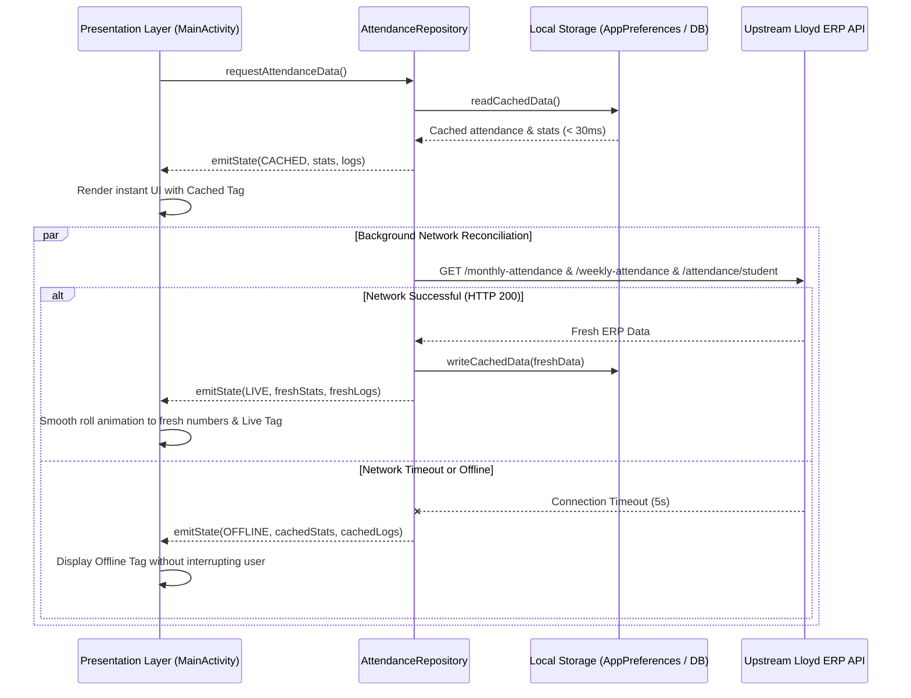

# Lloyd Student Application Synchronization Specification

## 1. Offline-First Synchronization Architecture

The Lloyd Student application implements an **Offline-First, Cache-Then-Network** synchronization pipeline to guarantee instant usability under weak or non-existent classroom Wi-Fi and cellular conditions.

---

## 2. Synchronization Flow

---

## 3. Background Synchronization (WorkManager)

- **Worker Class**: `AttendanceSyncWorker`
- **Interval**: 15 minutes (minimum allowable under Android WorkManager constraints).
- **Constraints**:
  - `NetworkType.CONNECTED`: Only triggers when the operating system detects an active internet connection.
- **Diff Detection & Dynamic Island Alert**:
  - Compares the `id` of the top attendance record against `last_seen_attendance_id`.
  - If a new record is discovered and notification preferences are active:
    - Fires `NotificationHelper.showAttendanceMarkedNotification()`.
    - Updates `last_seen_attendance_id`.
  - Automatically updates home screen widgets via `AttendanceWidgetProvider.updateAllWidgets()`.

---

## 4. Telemetry & State Indicators

| State | Status Dot | Status Label | Meaning |
| :--- | :--- | :--- | :--- |
| **LIVE** | Emerald `#10B981` | `● Live (Synced)` | Application has successfully fetched up-to-the-minute ERP records. |
| **SYNCING** | Amber `#F59E0B` | `● Syncing...` | Network request is currently executing in background. |
| **CACHED** | Sky Blue `#38BDF8` | `● Cached Today 10:45 AM` | Data loaded instantly from disk; awaiting or completing background sync. |
| **OFFLINE** | Slate `#94A3B8` | `● Offline (Cached)` | Device cannot reach the ERP server; all features remain interactive. |
