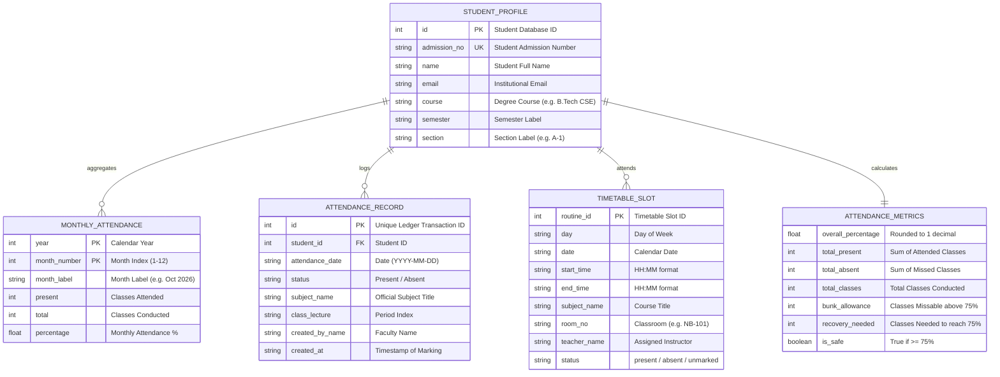

# AGY Data Model, Data Surfaces & Classification Specification — Lloyd ERP

**Target System:** `https://erp.lloydcollege.in`  
**Domains Covered:** Student Identity, Attendance Data Surface, Timetable Data Surface, and Data Governance  

---

## 1. Domain Entity Relationship Diagram

---

## 2. Attendance Data Surface Specification

The verified attendance data surface comprises three complementary layers:

| Layer | Source Endpoint | Granularity | Data Attributes Available |
| :--- | :--- | :--- | :--- |
| **Overall Summary** | `/api/student/me/monthly-attendance` | Cumulative Session | Aggregate total classes, aggregate attended, calculated overall percentage. |
| **Monthly Breakdown** | `/api/student/me/monthly-attendance` | Month-by-Month | Year, month number, month display label, present count, total count, monthly percentage. |
| **Class Ledger Logs** | `/api/attendance/student` | Individual Lecture | Transaction ID, date, lecture slot, subject title, teacher name, status (Present/Absent), entry timestamp. |

---

## 3. Timetable Data Surface Specification

The dynamic timetable surface is populated via `GET /api/student/me/weekly-attendance`:

| Attribute | Availability | Formatting | Behavioral Handling in Client |
| :--- | :---: | :--- | :--- |
| **Day of Week** | Yes | "Monday", "Tuesday", etc. | Groups schedule into 6 daily tabs (Mon–Sat). |
| **Date** | Yes | "YYYY-MM-DD" | Binds routine to specific academic calendar date. |
| **Period Slots** | Yes | 1 to 7 sequential slots | Rendered as chronological vertical cards. |
| **Subject Title** | Yes | Full string (e.g. "Applied Chemistry") | Primary card title. |
| **Faculty Name** | Yes | Title + Name (e.g. "Dr. Vivek Das") | Displayed beneath subject title. |
| **Room Number** | Yes | Room code (e.g. "NB-101", "Lab 2") | Location badge on card. |
| **Start / End Time** | Yes | 24h format (e.g. "09:00", "09:50") | Timeline pill. |
| **Marking Status** | Yes | "present", "absent", "unmarked" | Card color / status pill. |

### Edge Case Handling Rules:
* **Weekend (Sunday):** API omits Sunday; client displays a clean "No Classes Scheduled — Enjoy your weekend" placeholder.
* **Empty Schedule / Holiday:** If `periods` array is empty, client renders "Official College Holiday / No Classes".
* **Unmarked Period:** Status `"unmarked"` indicates an upcoming or unrecorded class; rendered with a neutral grey outline.

---

## 4. Comprehensive Data Classification & Android Storage Policy

| Field / Attribute | Classification | Can Android Use It? | Should Android Store It? | Can It Be Cached? | Recommended Sync Frequency |
| :--- | :--- | :---: | :---: | :---: | :--- |
| `access_token` | `HIGHLY-SENSITIVE` | Yes (Header) | Yes (EncryptedSharedPreferences) | No | On token expiration (24h) |
| `refresh_token` | `HIGHLY-SENSITIVE` | Yes (Refresh) | Yes (EncryptedSharedPreferences) | No | On login / rotation |
| `password` | `HIGHLY-SENSITIVE` | Transient Only | **NO — PURGE IMMEDIATELY** | **NO** | Never stored |
| `student_id` / `admission_no` | `SENSITIVE` | Yes (Profile) | Yes (Encrypted) | Yes | On login / session sync |
| `name` | `SENSITIVE` | Yes (Header) | Yes (Encrypted) | Yes | On profile refresh |
| `overall_percentage` | `STUDENT-SPECIFIC` | Yes (Dashboard) | Yes (Room / SharedPreferences) | Yes | Hourly / On-Demand |
| `monthly_attendance` | `STUDENT-SPECIFIC` | Yes (Dashboard) | Yes (Room Database) | Yes | Hourly / On-Demand |
| `weekly_schedule` | `PUBLIC` | Yes (Schedule) | Yes (Room Database) | Yes | Daily (06:00 AM) |
| `attendance_ledger` | `STUDENT-SPECIFIC` | Yes (History) | Yes (Room Database) | Yes | Hourly / Background Worker |
| `created_by_name` (Faculty) | `ADMINISTRATIVE` | Yes (History) | Yes (Room Database) | Yes | With ledger items |
| `foreign_keys` (`class_id`, etc.) | `INTERNAL` | **NO** | **NO — IGNORE** | No | Discarded on deserialization |
