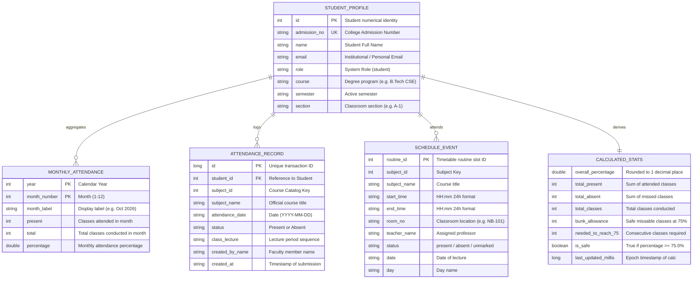

# Lloyd ERP — Data Model & Classification Specification

**Target System:** Lloyd ERP (`https://erp.lloydcollege.in`)  
**Domain:** Student Attendance, Academic Timetable, and Identity Management  

---

## 1. Entity-Relationship Model

---

## 2. Exhaustive Data Classification Dictionary

Every data field discovered in the Lloyd ERP API surface is classified according to institutional confidentiality:

| Field Name | Entity | Source Endpoint | Classification | Justification & Android Handling |
| :--- | :--- | :--- | :--- | :--- |
| `access_token` | Auth | `/auth/login`, `/auth/refresh` | **HIGHLY-SENSITIVE** | Bearer credential. Must reside strictly in Android Keystore; never logged. |
| `refresh_token` | Auth | `/auth/login`, `/auth/refresh` | **HIGHLY-SENSITIVE** | Long-lived session key. Stored in Keystore; never emitted in UI. |
| `password` | Auth | Client Request | **HIGHLY-SENSITIVE** | Master student secret. Must be purged immediately after initial login. |
| `admission_no` | Profile | `/auth/login` | **SENSITIVE** | Official student ID. Maskable in UI under Stealth Mode. |
| `name` | Profile | `/auth/login` | **SENSITIVE** | Student legal identity. Displayed in app bar. |
| `email` | Profile | `/auth/login` | **SENSITIVE** | Student email address. Redacted from telemetry. |
| `attendance_date`| Record | `/attendance/student` | **SENSITIVE** | Reveals student location on specific dates. |
| `status` | Record | `/attendance/student` | **SENSITIVE** | Physical presence verification ("Present" / "Absent"). |
| `created_by_name`| Record | `/attendance/student` | **ADMINISTRATIVE** | Faculty member identity. Displayed on lecture cards. |
| `school_id` | Record | `/attendance/student` | **INTERNAL** | Multi-tenant database key. Safe to ignore in UI. |
| `class_id` | Record | `/attendance/student` | **INTERNAL** | Database foreign key. Safe to ignore in UI. |
| `semester_id` | Record | `/attendance/student` | **INTERNAL** | Database foreign key. Safe to ignore in UI. |
| `section_id` | Record | `/attendance/student` | **INTERNAL** | Database foreign key. Safe to ignore in UI. |
| `subject_id` | Record | `/attendance/student` | **INTERNAL** | Course catalog identifier. |
| `subject_name` | Record | `/attendance/student` | **PUBLIC** | Course catalog title (e.g., "Applied Mathematics-I"). |
| `room_no` | Schedule | `/student/me/weekly-attendance`| **PUBLIC** | Physical room designation (e.g., "NB-101"). |
| `start_time` | Schedule | `/student/me/weekly-attendance`| **PUBLIC** | Standard institutional timetable slot. |

---

## 3. Mathematical Domain Invariants & Formulas

### 3.1 Attendance Percentage Invariant
Let $P$ represent total present lectures and $T$ represent total conducted lectures:
$$\text{Percentage} = \begin{cases} 100.0\% & \text{if } T = 0 \\ \text{round}\left(\frac{P}{T} \times 100, 1\right) & \text{if } T > 0 \end{cases}$$

### 3.2 Safe Bunk Margin Formula ($\ge 75.0\%$)
The maximum lectures $B$ a student can safely miss without their overall attendance falling below threshold $T_{\text{target}} = 0.75$:
$$\frac{P}{T + B} \ge 0.75 \implies B \le \frac{P - 0.75 \times T}{0.75}$$
$$B = \max\left(0, \left\lfloor \frac{P - 0.75 \times T}{0.75} \right\rfloor\right)$$

### 3.3 Recovery Consecutive Lectures Formula ($< 75.0\%$)
The minimum consecutive lectures $R$ a student must attend to elevate their attendance to threshold $T_{\text{target}} = 0.75$:
$$\frac{P + R}{T + R} \ge 0.75 \implies 0.25 \times R \ge 0.75 \times T - P$$
$$R = \max\left(1, \left\lceil \frac{0.75 \times T - P}{0.25} \right\rceil\right)$$
