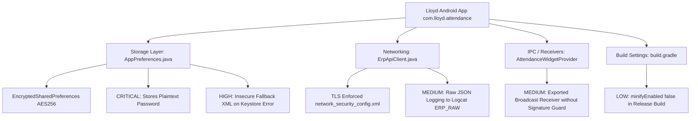

# AGY Android Application Security & ERP Alignment Audit

**Package:** `com.lloyd.attendance`  
**Repository:** `nkpcore/lloyd-erp` (`android/`)  
**Standard:** OWASP Mobile Application Security Verification Standard (MASVS v2.0)  
**Target Platform:** Android API 26 (Min) to API 34 (Target)  

---

## 1. Application Security Architecture Matrix



---

## 2. In-Depth Vulnerability Analysis (MASVS)

### 2.1 Plaintext Password Persistence & Fallback Insecurity (MASVS-STORAGE)
* **Location:** `com.lloyd.attendance.data.AppPreferences.java` (Lines 45-64)
* **Mechanism:**
  ```java
  public void saveCredentials(String username, String password) {
      prefs.edit()
              .putString(KEY_USERNAME, username)
              .putString(KEY_PASSWORD, password)
              .apply();
  }
  ```
* **Audit Finding:** The application stores the student's raw password in persistent storage to enable background re-login if refresh tokens expire.
* **The Fallback Trap:** When the Android Keystore is unavailable (common on modified Android distributions, older devices, or certain custom ROMs), the catch-block instantiates standard unencrypted `SharedPreferences` (`PREF_NAME + "_fallback"`), persisting the student's password in **plaintext XML** on disk:
  `/data/data/com.lloyd.attendance/shared_prefs/lloyd_attendance_secure_prefs_fallback.xml`
* **Remediation:**
  1. Purge `KEY_PASSWORD` entirely from `AppPreferences`.
  2. Rely exclusively on the OAuth2 refresh token (`/api/auth/refresh`) for background session maintenance.
  3. When the refresh token expires or is rejected (HTTP 401), navigate the user to the login screen rather than storing credentials.

### 2.2 Production Telemetry & Logcat Data Leakage (MASVS-CODE)
* **Location:** `com.lloyd.attendance.api.ErpApiClient.java` (Lines 193, 226, 283)
* **Mechanism:**
  `android.util.Log.i("ERP_RAW", "Monthly (" + response.code() + "): " + resStr);`
* **Audit Finding:** The networking layer logs raw HTTP payloads containing student names, roll numbers, attendance dates, and faculty names to the system Logcat buffer.
* **Aggravating Factor:** In `build.gradle`, `release { minifyEnabled false }` is set. ProGuard/R8 code minification and log-stripping rules (`-assumenosideeffects`) are not enabled, leaving verbose logging active in production APKs.

### 2.3 Unprotected Exported Broadcast Receiver (MASVS-PLATFORM)
* **Location:** `AndroidManifest.xml` (Line 29)
* **Receiver:** `AttendanceWidgetProvider` is declared with `android:exported="true"` to receive `ACTION_REFRESH_WIDGET`.
* **Risk:** Any third-party application installed on the student's device can dispatch rapid intents to trigger continuous network sync loops and battery drain.
* **Remediation:** Enforce a custom signature permission (`android:permission="com.lloyd.attendance.permission.SYNC_WIDGET"`) or validate caller UID.

---

## 3. ERP Capabilities vs. Android Implementation Alignment

A comprehensive comparison between the capabilities discovered on `erp.lloydcollege.in` and their implementation status in `nkpcore/lloyd-erp`:

| Capability / Surface | ERP API Source | Android Code Location | Integration Status | Posture Assessment |
| :--- | :--- | :--- | :---: | :--- |
| **Authentication** | `POST /api/auth/login` | `ErpApiClient.login()` | **Integrated** | Functional; needs removal of password storage. |
| **Token Refresh** | `POST /api/auth/refresh`| `ErpApiClient.refreshToken()` | **Integrated** | Properly synchronized via mutex `ensureValidToken()`. |
| **Monthly Summary**| `GET /api/student/me/monthly-attendance` | `ErpApiClient.getMonthlyAttendance()` | **Integrated** | Bound securely via `/me`; powers Dashboard ring. |
| **Weekly Schedule**| `GET /api/student/me/weekly-attendance` | `TimetableRepository.java` | **Partially Integrated** | ERP provides dynamic weekly routine; client falls back to hardcoded Section A-1. |
| **Class Ledger** | `GET /api/attendance/student?student_id=...` | `ErpApiClient.getStudentAttendance()` | **Integrated (Unsafe)** | Functional with pagination (`page_size=100`), but relies on client-supplied `student_id`. |
| **Student Profile**| Embedded in `/api/auth/login` | `UserProfile.java` | **Integrated** | Deserialized and displayed in top identity bar. |
| **Bunk Simulator** | Calculated client-side | `MainActivity.java` | **Integrated** | 100% mathematical client simulation; zero backend dependencies. |
| **Exams / Results**| *Not exposed on API* | *None* | **Not Available** | Missing from upstream ERP. Cannot be integrated without mock data. |
| **Fee Ledgers** | *Not exposed on API* | *None* | **Not Available** | Missing from upstream ERP. |
| **Library Cards** | *Not exposed on API* | *None* | **Not Available** | Missing from upstream ERP. |
| **Campus Notices** | *Not exposed on API* | *None* | **Not Available** | Missing from upstream ERP. |
