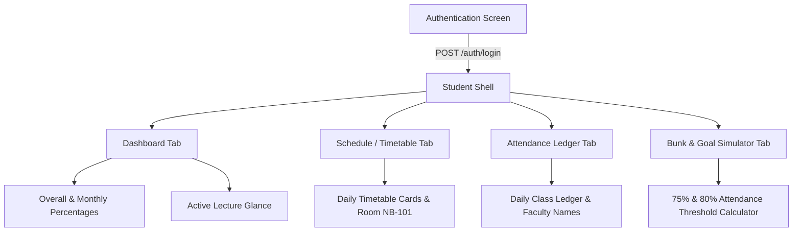

# AGY Application Map — Lloyd ERP Student Portal

**Target Application:** Lloyd ERP (`https://erp.lloydcollege.in`)  
**Client Interface:** Web Application, PWA SPA, and Android Client (`com.lloyd.attendance`)  
**Scope:** Authenticated Student Workflow & Interactive Surface  
**Protocol:** Strictly observed UI elements, actions, and network transactions  

---

## 1. Application Layout Architecture

The student portal presents a clean 4-module responsive interface built around the student identity and attendance lifecycle:

---

## 2. Interactive Surface Mapping

### 2.1 Authentication & Session Gateway
* **Route:** `/auth/login` (Web SPA and Android `LoginActivity`)
* **Interactive Elements:**
  * `Username Input`: Student enrollment number / Admission ID.
  * `Password Input`: Student portal secret key.
  * `Remember Me / Biometric Trigger`: Caches credentials locally for fast authentication.
  * `Login Action Button`: Submits credentials to ERP authentication endpoint.
* **Network Call:** `POST /api/auth/login`
* **Response Triggers:** Receives JWT bearer token, refresh token, user profile, and redirects to Dashboard.

### 2.2 Global Top Bar
* **Student Identity Card**: Displays student full name (`user.name`), course, section (`user.section`), and admission number.
* **Connectivity & Sync Status Pill**: Indicates system network status (`Live`, `Syncing`, `Cached`, `Offline`).
* **Stealth Mode Toggle**: Masks attendance figures and personal identifying data on screen to prevent shoulder-surfing in public environments.
* **Manual Refresh Button**: Triggers immediate synchronization of all student data modules.
* **Logout Trigger**: Clears locally persisted tokens and navigates back to login view.

### 2.3 Module 1: Dashboard
* **Hero Attendance Ring**: Circular progress ring depicting overall attendance percentage, color-coded based on institutional minimums (Green >= 75%, Amber 65-74%, Red < 65%).
* **Metric Tiles**: Summary cards displaying:
  * Present classes count
  * Absent classes count
  * Total classes conducted
* **Live Period Glance**: Dynamically calculates the ongoing or upcoming lecture based on current device time and daily timetable schedule.
* **Monthly Attendance Breakdown**: List of past academic months with individual class counts and percentages.
* **Network Call:** `GET /api/student/me/monthly-attendance`

### 2.4 Module 2: Schedule & Timetable
* **Day Selector Chips**: Quick tabs for `Monday`, `Tuesday`, `Wednesday`, `Thursday`, `Friday`, `Saturday`.
* **Period Slot Cards**: Cards displaying:
  * Period index (Period 1 to 7)
  * Lecture timing (e.g., 09:10 - 10:05)
  * Subject name and code
  * Teacher / Faculty name
  * Classroom / Lab number (e.g., `NB-101`)
* **Break Indicators**: Explicit cards for `Lunch Break` and `Weekly Test` periods.
* **Network Call:** `GET /api/student/me/weekly-attendance`

### 2.5 Module 3: Attendance History & Class Ledger
* **Status Filter Chips**: `All`, `Present`, `Absent`.
* **Month Filter Chips**: Filtering transactions by specific academic month.
* **Subject Filter Chips**: Filtering records by enrolled course.
* **Search Input Field**: Real-time filtering across course titles and faculty names.
* **Chronological Transaction Stream**: Date-stamped cards showing each marked class, status pill, lecture title, and attendance marker.
* **Network Call:** `GET /api/attendance/student?student_id={id}&page={n}&page_size=100&sort_by=attendance_date&sort_dir=desc`

### 2.6 Module 4: Bunk & Goal Simulator
* **Interactive Threshold Controls**: Slider / stepper targeting 75% and 80% mandatory attendance thresholds.
* **Bunk Availability Calculator**: Informs students how many consecutive or cumulative classes may be missed while remaining above 75%.
* **Recovery Calculator**: Computes exactly how many consecutive classes must be attended to recover an attendance deficit.
* **Subject-Wise Status Cards**: Granular simulation per enrolled course.
* **Computation Mode**: 100% client-side calculation based on verified ERP ledger data.

---

## 3. Discovered vs. Unobserved Student Capabilities

| Feature Category | Observed in ERP API / UI | Android Implementation Status | Verification Status |
| :--- | :--- | :--- | :---: |
| **Authentication & Tokens** | Yes (`/auth/login`, `/auth/refresh`) | Implemented in `ErpApiClient` | **VERIFIED** |
| **Monthly Attendance** | Yes (`/student/me/monthly-attendance`) | Implemented in `MainActivity` | **VERIFIED** |
| **Weekly Schedule** | Yes (`/student/me/weekly-attendance`) | Static fallback in `TimetableRepository` | **VERIFIED (API)** |
| **Attendance Ledger** | Yes (`/attendance/student`) | Implemented in `HistoryAdapter` | **VERIFIED** |
| **Student Profile** | Yes (Embedded in `/auth/login`) | Deserialized into `UserProfile` | **VERIFIED** |
| **Exam / Results** | No endpoint observed in client/SPA | Not implemented | **UNOBSERVED** |
| **Fee Ledgers / Receipts** | No endpoint observed in client/SPA | Not implemented | **UNOBSERVED** |
| **Library Management** | No endpoint observed in client/SPA | Not implemented | **UNOBSERVED** |
| **Assignments / Homework**| No endpoint observed in client/SPA | Not implemented | **UNOBSERVED** |
| **Campus Notices** | No endpoint observed in client/SPA | Not implemented | **UNOBSERVED** |
