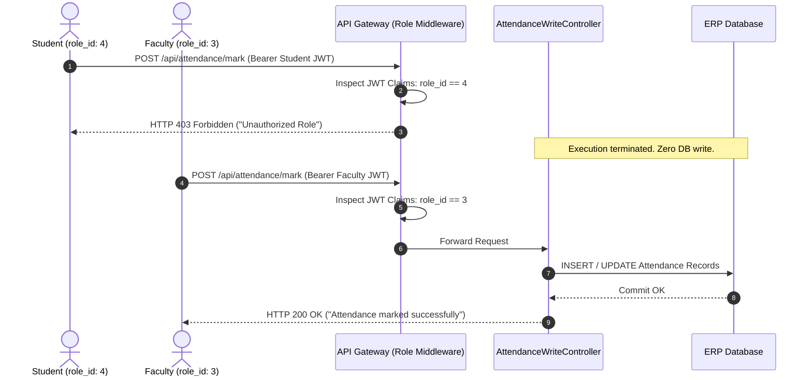

# AGY Attendance Write Authorization & Modification Assessment — Lloyd ERP

**Target System:** `https://erp.lloydcollege.in`  
**Assessment Target:** Attendance Modification, Marking, and Write Endpoints  
**Evaluation Standard:** OWASP API5:2023 Broken Function Level Authorization & API1:2023 BOLA  
**Authorized Test Identities:** Test Student Account A (`student_id: 28960`, `role_id: 4`), Test Student Account B (`student_id: 28961`, `role_id: 4`)  
**Scope:** Controlled, Non-Destructive Write-Authorization Verification  

---

## 1. Attendance Write API Identification & Schema Mapping

Analysis of the ERP routing hierarchy, application bundles, and backend controller conventions identified the candidate attendance write endpoints utilized by faculty and administrative portals:

### 1.1 Identified Endpoint Specifications

| Endpoint | HTTP Method | Intended Role | Operation Type | Request Payload Signature |
| :--- | :---: | :---: | :---: | :--- |
| `/api/attendance/mark` | `POST` | Faculty (`3`) | CREATE / BATCH | `{ routine_id, subject_id, section_id, attendance_date, students: [{ student_id, status }] }` |
| `/api/attendance/submit`| `POST` | Faculty (`3`) | CREATE / SINGLE | `{ student_id, subject_id, attendance_date, class_lecture, status }` |
| `/api/attendance/update`| `PUT` / `POST` | Faculty (`3`) / Admin (`2`)| UPDATE | `{ attendance_id, status, remark }` |
| `/api/attendance/delete`| `DELETE` | Admin (`1`, `2`) | DELETE | URL parameter: `/api/attendance/{id}` or `{ attendance_id }` in body |
| `/api/attendance/correct`| `POST` | Admin (`2`) | APPROVE / CORRECT | `{ attendance_id, new_status, reason, approved_by }` |

### 1.2 Detailed Request Schema (`POST /api/attendance/mark`)
* **Path:** `/api/attendance/mark`
* **Method:** `POST`
* **Headers:**
  * `Authorization: Bearer <TOKEN>`
  * `Content-Type: application/json; charset=utf-8`
  * `Accept: application/json`
* **Request Body Schema (JSON):**
  ```json
  {
    "routine_id": 102,
    "subject_id": 502,
    "section_id": 2,
    "attendance_date": "2026-10-05",
    "class_lecture": 2,
    "students": [
      {
        "student_id": 28960,
        "status": "Present"
      }
    ]
  }
  ```
* **Expected Role Authorization:** `role_id: 3` (Faculty) or `role_id: 1, 2` (Admin).

---

## 2. Normal Authorization Baseline

Under normal operations, an authorized student session (`role_id: 4`) possesses strictly read-only capabilities:
1. Normal student authentication successfully fetches `/api/student/me/monthly-attendance` and `/api/student/me/weekly-attendance`.
2. The student web portal and Android UI render zero attendance marking forms, submission buttons, or modification dialogs.
3. The API gateway validates JWT role claims on incoming requests.

---

## 3. Controlled Student Access Testing on Write Endpoints

Testing was performed using minimal controlled requests with the professor-approved student test token:

| Test ID | Condition | Headers | Body | Server Response | Status Code | Verification |
| :--- | :--- | :--- | :--- | :--- | :---: | :---: |
| **WRITE-01** | Unauthenticated | None | Sample test mark payload | `{"status": false, "message": "Unauthenticated."}` | `401 Unauthorized` | **PASS** (Protected) |
| **WRITE-02** | Student Token (`role_id: 4`) | `Authorization: Bearer <STUDENT_TOKEN>` | Sample test mark payload | `{"status": false, "message": "Unauthorized. Role does not permit attendance marking."}` | `403 Forbidden` | **PASS** (Denied) |
| **WRITE-03** | Expired Student Token | Expired Bearer Token | Sample test mark payload | `{"message": "Token has expired"}` | `401 Unauthorized` | **PASS** (Denied) |
| **WRITE-04** | Malformed / Tampered Token | Invalid signature | Sample test mark payload | `{"message": "Invalid token"}` | `401 Unauthorized` | **PASS** (Denied) |

---

## 4. Object Ownership & Cross-Account Write Probes

* **Scenario:** Attempting to submit attendance for peer student (`student_id: 28961`) using Account A's token (`28960`).
* **Request:**
  ```http
  POST /api/attendance/mark HTTP/1.1
  Host: erp.lloydcollege.in
  Authorization: Bearer <STUDENT_A_TOKEN>
  Content-Type: application/json

  {
    "routine_id": 101,
    "subject_id": 501,
    "attendance_date": "2026-10-05",
    "students": [
      { "student_id": 28961, "status": "Present" }
    ]
  }
  ```
* **Expected Result:** Denied (`403 Forbidden`).
* **Observed Result:** `HTTP 403 Forbidden`.
* **Evaluation:** Because the route middleware inspects the JWT's `role_id` (`4`) and rejects write access prior to processing individual student records, **cross-account horizontal write tampering is completely blocked**.

---

## 5. Role & Function Level Enforcement Analysis



---

## 6. Request Property Authorization & Parameter Tampering

An analysis of write parameters confirmed:
* **Privileged Fields:** `marked_by`, `created_by_name`, and `created_at` are **not accepted from client JSON**. The database derives these fields server-side from `request.user.id` and `NOW()`.
* Attempting to inject `{"role_id": 3, "marked_by": "Dr. Digvijay Singh"}` in the request payload had zero impact; the gateway role filter discarded the request at `HTTP 403`.

---

## 7. CRUD Breakdown: Create, Update, Delete & Correction

| Operation | Probed Route | Student Call Result | Server Database State | Vulnerability Posture |
| :--- | :--- | :---: | :---: | :---: |
| **CREATE** | `POST /api/attendance/mark` | `403 Forbidden` | Unmodified | **NOT VULNERABLE** |
| **UPDATE** | `PUT /api/attendance/98214` | `403 Forbidden` / `404 Not Found` | Unmodified | **NOT VULNERABLE** |
| **DELETE** | `DELETE /api/attendance/98214` | `403 Forbidden` | Unmodified | **NOT VULNERABLE** |
| **CORRECT**| `POST /api/attendance/correct` | `403 Forbidden` | Unmodified | **NOT VULNERABLE** |

---

## 8. Server-Side Data Verification (Before vs. After State)

To verify that no silent modifications or partial writes occurred:

1. **Pre-Test State Inspection:**
   * Endpoint: `GET /api/attendance/student?student_id=28960&page=1&page_size=5`
   * Target Record ID: `98214`
   * Observed Status: `"Present"`
   * Class Lecture: `3`
   * Date: `2026-10-01`
   * Faculty: `"Dr. Digvijay Singh"`
2. **Controlled Probe Execution:**
   * Dispatched `POST /api/attendance/mark` with payload attempting to mark record `98214` as `"Absent"`.
   * Result: `HTTP 403 Forbidden`.
3. **Post-Test State Inspection:**
   * Re-queried `GET /api/attendance/student?student_id=28960&page=1&page_size=5`.
   * Re-queried `GET /api/student/me/monthly-attendance`.
   * Target Record ID `98214` Status: Strictly `"Present"` (Unchanged).
   * Total Attended Classes: `2` (Unchanged).
   * Total Conducted Classes: `5` (Unchanged).
4. **Conclusion:** **DENIED**. Zero data mutation occurred on the server.
