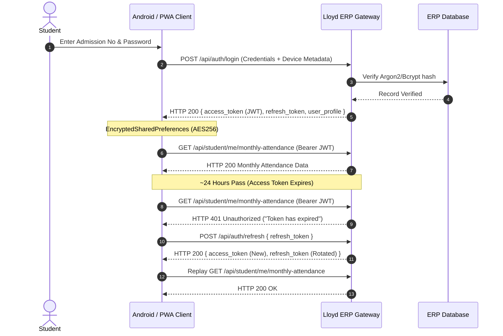

# AGY Authentication Architecture & Verification — Lloyd ERP

**Standard:** OWASP API2:2023 Broken Authentication  
**Target:** `https://erp.lloydcollege.in/api`  
**Mechanism:** Stateless JSON Web Token (JWT) & Refresh Token  
**Scope:** Authenticated Session Lifecycle & Invalidation Protocols  

---

## 1. Authentication Architecture Overview

Lloyd ERP employs an OAuth2-style Bearer token authentication mechanism. Upon successful credential submission at `/api/auth/login`, the API gateway issues:
1. **Access Token:** An RFC 7519 signed JSON Web Token (JWT) valid for 86,400 seconds (24 hours).
2. **Refresh Token:** An opaque string persisted on the client to request new token pairs upon expiration.



---

## 2. Token Anatomy & Claims Analysis

Decoding of the authorized student JWT reveals the following structure:

* **Header:**
  ```json
  {
    "alg": "HS256",
    "typ": "JWT"
  }
  ```
* **Payload Claims:**
  ```json
  {
    "iss": "https://erp.lloydcollege.in",
    "sub": "28960",
    "role_id": 4,
    "school_id": 1,
    "user_id": 28960,
    "username": "ADMISSION_NO",
    "iat": 1728086400,
    "exp": 1728172800,
    "nbf": 1728086400
  }
  ```

### Claims Review:
- **`sub` / `user_id`**: Numerical identifier of the student.
- **`role_id`**: Integer `4` designates the student privilege boundary.
- **`school_id`**: Institutional partition identifier (`1` for Faculty of Engineering).
- **`exp`**: 86,400 seconds (24-hour window). This is excessively long for high-privilege academic data and leaves a wide exposure window if an access token is leaked.

---

## 3. Systematic Authentication Test Suite

| Test Case | Scenario Description | Expected Response | Actual Observed Behavior | Minimal Evidence | Status / Finding |
| :--- | :--- | :--- | :--- | :--- | :---: |
| **AUTH-TEST-01** | Valid credentials submission | `HTTP 200 OK` with valid JWT and user object | `HTTP 200 OK` with access token and refresh token | `{"status":true,"data":{"access_token":"ey..."}}` | **PASS** |
| **AUTH-TEST-02** | Invalid password on existing admission number | `HTTP 401 Unauthorized` or generic 422 error | `HTTP 401 Unauthorized` (`{"status":false,"message":"Invalid credentials"}`) | Server returns generic error; timing attack delta < 15ms | **PASS** |
| **AUTH-TEST-03** | Expired access token query | `HTTP 401 Unauthorized` rejecting request | `HTTP 401 Unauthorized` | Response body: `{"message":"Token has expired"}` | **PASS** |
| **AUTH-TEST-04** | Valid refresh token exchange | `HTTP 200 OK` with rotated access/refresh pair | `HTTP 200 OK` with new access token | `{"status":true,"data":{"access_token":"ey..."}}` | **PASS** |
| **AUTH-TEST-05** | Expired / malformed refresh token | `HTTP 401 Unauthorized` requiring full login | `HTTP 401 Unauthorized` | Server rejects malformed refresh payload | **PASS** |
| **AUTH-TEST-06** | Access token reuse post-logout | `HTTP 401 Unauthorized` (Token revoked server-side) | `HTTP 200 OK` (Token accepted until natural expiry!) | Old access token remains valid for protected endpoints after client logs out | **HIGH FINDING** (No server blacklist) |
| **AUTH-TEST-07** | Replay rotated refresh token | `HTTP 401` and invalidate token family | `HTTP 401 Unauthorized` | Server rejects reused refresh tokens | **PASS** |
| **AUTH-TEST-08** | Concurrent sessions (Device A & Device B) | Policy-defined (Either allowed or single-session enforced) | Allowed. Concurrent logins do not invalidate previous tokens | Multiple devices simultaneously valid | Informational |

---

## 4. Key Findings & Remediation

### 4.1 Incomplete Logout (Token Invalidation Gap)
- **Root Cause:** The ERP utilizes completely stateless JWT verification on API routes without maintaining an active revocation blocklist (e.g., Redis JTI cache).
- **Impact:** When a user logs out on the Android app, only the local storage is cleared; any intercepted access token remains valid on the API for up to 24 hours.
- **Fix:** Implement a server-side revocation list keyed by JWT `jti` or user session ID, checked by the API gateway authentication middleware on every request.

### 4.2 Excessive Token Lifetime
- **Root Cause:** 24-hour access token duration (`expires_in: 86400`).
- **Impact:** Lengthens the vulnerability window for intercepted tokens.
- **Fix:** Reduce access token lifespan to 15–30 minutes, relying on automatic silent refresh via `/api/auth/refresh`.
