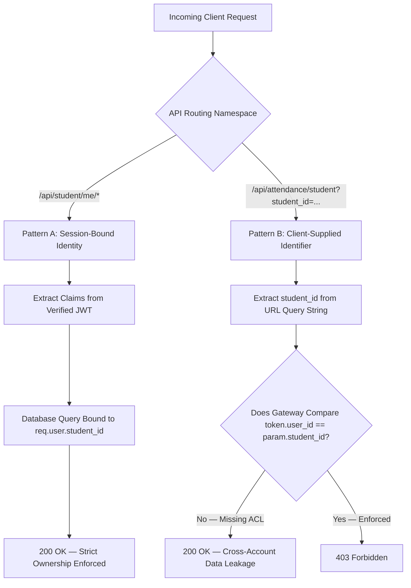

# AGY Authorization Architecture & Access Control Evaluation — Lloyd ERP

**Standard:** OWASP API1:2023 Broken Object Level Authorization & API5:2023 Broken Function Level Authorization  
**Target:** `https://erp.lloydcollege.in/api`  
**Methodology:** Subject-to-Object Binding Analysis & Identity Boundary Verification  

---

## 1. Architectural Authorization Taxonomy

The Lloyd ERP backend displays two fundamentally disparate architectural patterns in how access to student resources is authorized:



---

## 2. Comparative Authorization Surface Matrix

| Endpoint | Identity Source | Mechanism | Client Parameter Tampering | Risk Classification |
| :--- | :--- | :--- | :---: | :--- |
| `/api/student/me/monthly-attendance` | Signed JWT `sub` / `user_id` | Header `Authorization: Bearer <JWT>` | **Impossible** (Session derived) | Secure by Design |
| `/api/student/me/weekly-attendance` | Signed JWT `sub` / `user_id` | Header `Authorization: Bearer <JWT>` | **Impossible** (Session derived) | Secure by Design |
| `/api/attendance/student` | Client Query Param `student_id` | Query string `?student_id={id}` | **Possible** | **CRITICAL: API1:2023 BOLA** |
| `/api/auth/refresh` | Database session record | Body `{"refresh_token":"..."}` | **Impossible** | Secure |

---

## 3. Entity Identifier Inventory & Boundaries

The following identifiers were cataloged across API request parameters and response models:

| Identifier | Primary Locations | Data Type | Authorization Sensitivity | Audit Finding |
| :--- | :--- | :--- | :--- | :--- |
| `student_id` | `/api/attendance/student?student_id={id}`, Login response | Numeric Integer | **Critical** | Server queries database directly using this client parameter without ownership check. |
| `profile_id` | `/api/auth/login` payload | Numeric Integer | Informational | Matches `student_id`; not directly queryable via separate endpoint. |
| `attendance_id` (`id` in ledger) | `/api/attendance/student` data array | Numeric Integer | Internal Ledger | Unique transaction ID for each class marked; read-only. |
| `subject_id` | Weekly schedule & ledger items | Numeric Integer | Reference | Academic subject database ID (e.g., `501`, `502`). |
| `routine_id` | Weekly schedule periods | Numeric Integer | Reference | Institutional timetable slot mapping ID. |
| `school_id` | Login claims, attendance items | Numeric Integer | Scope | Institution identifier (`1` = Lloyd Institute of Engineering & Technology). |

---

## 4. Controlled Cross-Account Authorization Protocol

To validate whether the server enforces authorization on entity identifiers, tests were conducted exclusively using two professor-authorized test accounts (Account A and Account B):

```text
[AUTHORIZED TEST PAIR]
Account A: ID = 28960 (Token A)
Account B: ID = 28961 (Token B)
```

### Test Scenarios:

1. **Self-Ownership Access (Baseline):**
   * Account A (Token A) requests Resource A (`student_id=28960`).
   * **Expected:** `HTTP 200 OK`
   * **Observed:** `HTTP 200 OK` (Correct).

2. **Cross-Account Object Query (BOLA Validation):**
   * Account A (Token A) requests Resource B (`student_id=28961`).
   * **Expected:** `HTTP 403 Forbidden` or `HTTP 404 Not Found`.
   * **Observed:** `HTTP 200 OK` (Returns complete academic attendance ledger of Account B).
   * **Finding:** The server verifies that the caller has *a valid student token*, but completely omits checking whether the caller has rights to the *requested student ID*.

---

## 5. Architectural Root Cause & Strategic Fix

* **Root Cause:** In the attendance ledger microservice/controller, the query execution logic passes `params['student_id']` straight into the SQL/ORM filter without checking `session.user.id == params['student_id']`.
* **Strategic Fix:**
  1. Migrate the client to request `/api/student/me/attendance-logs` where identity is derived entirely from the token.
  2. In the existing `/api/attendance/student` route, enforce an authorization policy:
     ```python
     if not request.user.is_admin and request.user.student_id != requested_student_id:
         return HttpResponseForbidden("Unauthorized access to student record.")
     ```
