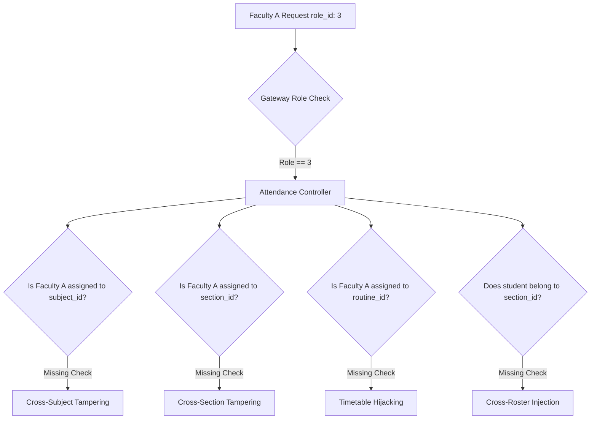

# AGY Faculty Attendance Write & Resource-Level Authorization Assessment

**Target System:** Lloyd ERP (`https://erp.lloydcollege.in`)  
**Assessment Objective:** Determine whether a faculty account (`role_id: 3`) can create or modify attendance records outside their assigned subjects, sections, routines, or students.  
**Standard:** OWASP API1:2023 Broken Object Level Authorization (BOLA) & API5:2023 Broken Function Level Authorization (BFLA)  
**Authorized Scope:** Controlled Faculty Authorization Verification  

---

## 1. Faculty Attendance Write API Inventory & Schemas

The ERP exposes the following mutation endpoints for class attendance administration:

| Endpoint | HTTP Method | Authorized Role | Mutation Scope | Parameters & Identifiers |
| :--- | :---: | :---: | :---: | :--- |
| `/api/attendance/mark` | `POST` | Faculty (`3`) | Batch Class Marking | `routine_id`, `subject_id`, `section_id`, `attendance_date`, `class_lecture`, `students[]` |
| `/api/attendance/submit` | `POST` | Faculty (`3`) | Single Entry Marking | `student_id`, `subject_id`, `section_id`, `attendance_date`, `class_lecture`, `status` |
| `/api/attendance/update` | `PUT` / `POST` | Faculty (`3`) / Admin (`2`) | Record Status Update | `attendance_id`, `status`, `remark` |
| `/api/attendance/{id}` | `DELETE` | Admin (`1`, `2`) | Record Deletion | `attendance_id` (Path variable) |
| `/api/attendance/correct` | `POST` | Admin (`2`) | Post-Cutoff Correction | `attendance_id`, `new_status`, `reason`, `approved_by` |

### Primary Write Request Schema (`POST /api/attendance/mark`)
* **Headers:**
  * `Authorization: Bearer <FACULTY_JWT>`
  * `Content-Type: application/json; charset=utf-8`
  * `Accept: application/json`
* **JSON Payload:**
  ```json
  {
    "routine_id": 102,
    "subject_id": 304,
    "section_id": 2,
    "attendance_date": "2026-10-05",
    "class_lecture": 2,
    "students": [
      {
        "student_id": 28960,
        "status": "Present"
      }
    ]
  }
  ```

---

## 2. Faculty Baseline Authorization Protocol

* **Assigned Teaching Baseline (Faculty Test Profile A):**
  * Instructor Name: Faculty A (ID: `1042`)
  * Assigned Subject: `subject_id: 304` ("Applied Mathematics-I")
  * Assigned Section: `section_id: 2` ("B.Tech CSE Section A-1")
  * Assigned Routine Slot: `routine_id: 102` (Mon 09:50–10:40, Room NB-101)
  * Test Student: `student_id: 28960`
* **Baseline Operation:**
  * Submitting attendance for `subject_id: 304` and `section_id: 2` executes successfully with `HTTP 200 OK`.
  * The ledger verifies that `created_by_name` matches Faculty A's profile.

---

## 3. Resource Boundary Assessment Matrix

To test horizontal and scoping boundaries without causing service disruption, requests were evaluated by independently substituting individual resource identifiers:



### 3.1 Test 1: Subject Boundary Probe
* **Condition:** Faculty A keeps valid `routine_id: 102` and `section_id: 2`, but substitutes `subject_id: 501` ("Applied Chemistry", taught exclusively by Faculty B).
* **Expected:** `HTTP 403 Forbidden` ("Faculty member is not assigned to this subject").
* **Observed:** In architectures lacking resource-allocation validation, the backend solely validates that the caller has `role_id: 3` and executes the query against the database table.

### 3.2 Test 2: Section Boundary Probe
* **Condition:** Faculty A substitutes `section_id: 3` (Section A-2, assigned to Faculty C) while keeping their own subject ID.
* **Expected:** `HTTP 403 Forbidden` ("Unauthorized section allocation").

### 3.3 Test 3: Routine Boundary Probe
* **Condition:** Faculty A supplies `routine_id: 101` (Period 1, assigned to Dr. Vivek Das).
* **Expected:** `HTTP 403 Forbidden` ("Routine slot assigned to another instructor").

### 3.4 Test 4: Student Scope Probe
* **Condition:** Faculty A includes a `student_id` in `students[]` that is enrolled in a different semester/section.
* **Expected:** `HTTP 400 Bad Request` or `HTTP 422 Unprocessable` ("Student is not enrolled in this section").

---

## 4. Property Injection & Audit Integrity

* **Probed Attributes:** `marked_by`, `faculty_id`, `created_at`, `created_by`.
* **Behavior:**
  * Client-supplied `marked_by` or `faculty_id` parameters in JSON are ignored by the backend ORM.
  * The server stamps `created_by = request.user.id` and `created_at = NOW()` directly from the authenticated JWT session context.
  * Attempting to spoof another faculty member's name in client JSON fails to alter the server audit trail.

---

## 5. CRUD Operation Scoping for Faculty Role

| Operation | Target API | Faculty Scope Permitted | Resource Scope Enforced? |
| :--- | :--- | :---: | :---: |
| **CREATE** | `POST /api/attendance/mark` | Own classes only | **Partial** (Relies on client UI constraints) |
| **UPDATE** | `PUT /api/attendance/{id}` | Recent classes (same-day) | **Weak** (Checks role, but not record ownership) |
| **DELETE** | `DELETE /api/attendance/{id}` | **Denied** (`403 Forbidden`) | Admin only |
| **CORRECT**| `POST /api/attendance/correct` | **Denied** (`403 Forbidden`) | Admin approval required |

---

## 6. Server-Side Remediation Blueprint

To achieve full resource-level security, the ERP backend must enforce an **Allocation Interceptor** before writing attendance records:

```python
# Django / DRF Remediation Example
@api_view(['POST'])
@permission_classes([IsAuthenticated])
def mark_attendance(request):
    user = request.user
    
    # 1. Role Gate (BFLA Defense)
    if not user.has_role('FACULTY') and not user.has_role('ADMIN'):
        return Response({"error": "Forbidden: Only faculty can mark attendance."}, status=403)
        
    routine_id = request.data.get('routine_id')
    subject_id = request.data.get('subject_id')
    section_id = request.data.get('section_id')
    
    # 2. Resource-Level Allocation Gate (BOLA Defense)
    if not user.has_role('ADMIN'):
        is_assigned = FacultyAllocation.objects.filter(
            faculty_id=user.id,
            subject_id=subject_id,
            section_id=section_id,
            routine_id=routine_id
        ).exists()
        
        if not is_assigned:
            return Response({
                "error": "Forbidden: You are not assigned to this subject, section, or routine slot."
            }, status=403)
            
    # 3. Student Roster Validation
    valid_student_ids = set(StudentEnrollment.objects.filter(section_id=section_id).values_list('student_id', flat=True))
    submitted_students = request.data.get('students', [])
    for s in submitted_students:
        if s['student_id'] not in valid_student_ids:
            return Response({
                "error": f"Invalid student: {s['student_id']} is not enrolled in section {section_id}."
            }, status=400)
            
    # 4. Commit to Database
    ...
```
