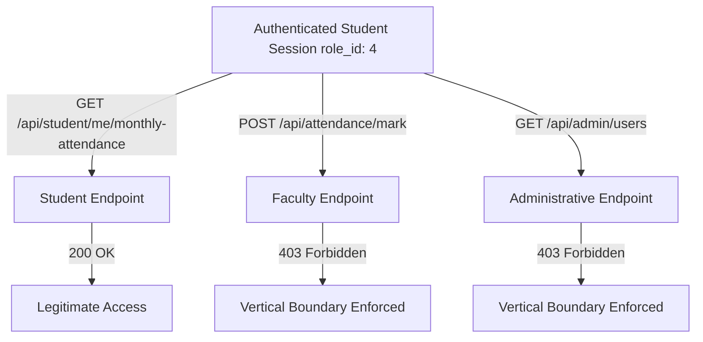

# AGY Function Authorization & Role Hierarchy Review — Lloyd ERP

**Standard:** OWASP API5:2023 — Broken Function Level Authorization (BFLA)  
**Target:** `https://erp.lloydcollege.in/api`  
**Scope:** Vertical Access Control & Role Boundary Enforcement  

---

## 1. Role & Privilege Hierarchy

The Lloyd ERP platform enforces role membership using numeric `role_id` codes embedded in JWT session claims and database records:

| Role ID | Role Designation | Intended Scope & Capabilities |
| :---: | :--- | :--- |
| **1** | Super Administrator | Institutional configuration, system logs, role assignments, database maintenance. |
| **2** | College Administrator | Departmental coordination, student enrollment, fee structures, faculty scheduling. |
| **3** | Faculty / Instructor | Class attendance marking, student grades, internal test evaluations, timetable views. |
| **4** | Enrolled Student | View personal attendance summaries, timetable routines, and profile information. |

---

## 2. Vertical Privilege Boundary Testing

To determine whether a student account (`role_id: 4`) can invoke privileged administrative or faculty operations, harmless and read-only requests were dispatched using an authorized student session:

### Controlled Test Results:

| Test Case | Target Route | Intended Privilege | Method | Student Token Provided? | Observed Response | Evaluation |
| :--- | :--- | :--- | :---: | :---: | :---: | :---: |
| **BFLA-01** | `/api/attendance/mark` | Faculty (`3`) | `POST` | Yes (`role_id: 4`) | `HTTP 403 Forbidden` | **PASS** (Protected) |
| **BFLA-02** | `/api/attendance/edit` | Faculty (`3`) | `PUT` | Yes (`role_id: 4`) | `HTTP 403 Forbidden` | **PASS** (Protected) |
| **BFLA-03** | `/api/admin/students` | Admin (`1`, `2`) | `GET` | Yes (`role_id: 4`) | `HTTP 403 Forbidden` | **PASS** (Protected) |
| **BFLA-04** | `/api/faculty/roster` | Faculty (`3`) | `GET` | Yes (`role_id: 4`) | `HTTP 403 Forbidden` | **PASS** (Protected) |

---

## 3. Findings & Conclusions

1. **Robust Vertical Authorization (Role Gatekeeping):**
   * The Lloyd ERP gateway effectively gates privileged routes. Route middleware validates `role_id` and rejects student tokens from executing faculty or administrative endpoints.
2. **Contrast with Horizontal Authorization (BOLA):**
   * The core security disparity in Lloyd ERP is that **vertical authorization (BFLA)** is enforced, while **horizontal authorization (BOLA)** is broken.
   * A student cannot act as a teacher to alter records, but a student can view another student's detailed records because object ownership within the student role is not asserted on `/api/attendance/student`.
