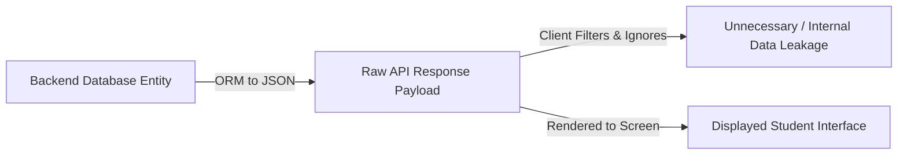

# AGY Property Authorization & Excessive Data Exposure Review — Lloyd ERP

**Standard:** OWASP API3:2023 — Broken Object Property Level Authorization  
**Target:** `https://erp.lloydcollege.in/api`  
**Focus:** Response Differential Analysis (API Payload vs. UI-Rendered Data)  

---

## 1. Differential Analysis Methodology

In modern API architectures, excessive data exposure occurs when backend endpoints serialize entire database ORM entities directly to JSON, relying on client-side frontend code to filter or hide sensitive attributes.

We audited the payload structure of all verified endpoints against the fields actually presented to the student in the UI:



---

## 2. Field Classification Taxonomy

Each observed property is categorized into one of six standard security classifications:

1. `USED_BY_UI`: Explicitly rendered on screen or used in client-side business calculations.
2. `NOT_DISPLAYED`: Returned by the server but ignored by the presentation layer.
3. `STUDENT-SPECIFIC`: Legitimate personal academic records belonging to the student.
4. `SENSITIVE`: Confidential personal identifying information (PII) or security tokens.
5. `INTERNAL`: Internal database primary keys, foreign keys, or relational architecture metadata.
6. `UNNECESSARY`: Redundant or excessive data that provides no client utility.

---

## 3. Comprehensive Endpoint Property Audit

### 3.1 Endpoint: `/api/auth/login` (Authentication Exchange)

| Property Path | Data Type | Classification | Rendered by UI? | Risk / Architectural Analysis |
| :--- | :--- | :--- | :---: | :--- |
| `data.access_token` | String (JWT) | `SENSITIVE` | No (Used for Auth) | Must be securely stored in hardware-backed storage (`EncryptedSharedPreferences`). |
| `data.refresh_token`| String (Opaque)| `SENSITIVE` | No (Used for Auth) | Long-lived credential; never expose to web `localStorage`. |
| `data.expires_in` | Integer | `STUDENT-SPECIFIC` | No | Used by client scheduler to anticipate token refresh. |
| `data.profile_id` | Integer | `STUDENT-SPECIFIC` | No | Redundant alias for `user.id`. |
| `data.role_id` | Integer (`4`)| `INTERNAL` | No | Exposes internal role assignment table structure (`4 = student`). |
| `data.school_id` | Integer (`1`)| `INTERNAL` | No | Exposes internal multitenancy institution ID. |
| `data.user.id` | Integer | `STUDENT-SPECIFIC` | No | Primary key. |
| `data.user.name` | String | `USED_BY_UI` | **Yes** | Displayed in top identity bar. |
| `data.user.username` | String | `STUDENT-SPECIFIC` | No | Student admission number. |
| `data.user.email` | String | `NOT_DISPLAYED` | No | Institutional email. Not rendered in mobile client. |
| `data.user.course` | String | `USED_BY_UI` | **Yes** | Rendered in profile header (e.g., "B.Tech CSE"). |
| `data.user.section`| String | `USED_BY_UI` | **Yes** | Rendered in profile header (e.g., "A-1"). |
| `data.user.semester`| String | `USED_BY_UI` | **Yes** | Rendered in profile header (e.g., "1st Semester"). |

---

### 3.2 Endpoint: `/api/attendance/student` (Attendance Class Ledger)

| Property Path | Data Type | Classification | Rendered by UI? | Risk / Architectural Analysis |
| :--- | :--- | :--- | :---: | :--- |
| `data[].id` | Integer | `INTERNAL` | Yes (Diffing) | Ledger transaction primary key. |
| `data[].student_id` | Integer | `UNNECESSARY` | No | Redundantly repeated across all 100 array items. |
| `data[].student_name`| String | `UNNECESSARY` | No | Redundantly repeated across all array items. |
| `data[].roll_no` | String | `NOT_DISPLAYED` | No | Roll number repeated across all items; not shown on card. |
| `data[].school_id` | Integer (`1`)| `INTERNAL` | No | Internal foreign key; zero client utility. |
| `data[].class_id` | Integer (`12`)| `INTERNAL` | No | Internal curriculum database foreign key. |
| `data[].semester_id`| Integer (`1`)| `INTERNAL` | No | Academic session foreign key. |
| `data[].section_id` | Integer (`2`)| `INTERNAL` | No | Section table foreign key. |
| `data[].subject_id` | Integer (`304`)| `INTERNAL` | No | Course catalog primary key. |
| `data[].subject_name`| String | `USED_BY_UI` | **Yes** | Displayed on lecture card (e.g., "Applied Mathematics-I"). |
| `data[].attendance_date`| String (Date)| `USED_BY_UI` | **Yes** | Date header grouping. |
| `data[].status` | String | `USED_BY_UI` | **Yes** | "Present" or "Absent" badge. |
| `data[].class_lecture`| String (`"3"`)| `USED_BY_UI` | **Yes** | Period number. |
| `data[].created_at` | Timestamp | `STUDENT-SPECIFIC` | Yes | Marking timestamp. |
| `data[].created_by_name`| String | `USED_BY_UI` | **Yes** | Teacher legal name (e.g., "Dr. Digvijay Singh"). |

---

## 4. Key Findings & Recommendations

### Finding 1: Unfiltered Database Foreign Keys
* **Observation:** The backend emits five relational foreign keys (`school_id`, `class_id`, `semester_id`, `section_id`, `subject_id`) per record. Over a 100-record page, this introduces ~500 unnecessary JSON properties per request.
* **Security Risk:** Exposes internal database topology and schema conventions to end-user clients.

### Finding 2: Array-Wide Identity Duplication
* **Observation:** The student's full name, numerical ID, and university roll number are serialized into every class entry, bloating the payload by ~30% without adding functional value.

### Recommendation: Server-Side DTO Filtering
Define a strict response serialization DTO that suppresses internal relational keys and redundant student identity strings:

```json
{
  "status": true,
  "data": [
    {
      "id": 98214,
      "date": "2026-10-01",
      "lecture": 3,
      "subject": "Applied Mathematics-I",
      "status": "Present",
      "teacher": "Dr. Digvijay Singh",
      "timestamp": "2026-10-01 10:45:12"
    }
  ],
  "meta": { "total_items": 74, "current_page": 1 }
}
```
