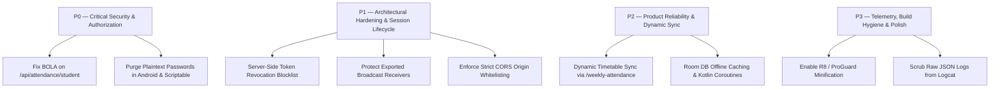

# AGY Comprehensive Remediation Plan & Roadmap — Lloyd ERP

**Target Systems:** Lloyd ERP API (`https://erp.lloydcollege.in`) & Android Application (`nkpcore/lloyd-erp`)  
**Scope:** Actionable Engineering Blueprints across P0, P1, P2, and P3 Priorities  

---

## 1. Remediation Priority Framework



---

## 2. P0: Critical Security & Authorization

### 2.1 Backend: Resolve Broken Object Level Authorization (SEC-FINDING-001)
* **Action:** Deprecate client-supplied `student_id` for student callers.
* **Server-Side Implementation:**
  ```python
  # Django / DRF Example
  @api_view(['GET'])
  @permission_classes([IsAuthenticated])
  def get_student_attendance(request):
      # Extract student ID strictly from verified JWT token
      auth_student_id = request.user.student_id

      # If parameter provided by staff/admin, allow; otherwise enforce strict identity match
      requested_id = request.GET.get('student_id')
      if requested_id and str(requested_id) != str(auth_student_id):
          if not request.user.has_role('FACULTY') and not request.user.has_role('ADMIN'):
              return Response({"error": "Forbidden: Cross-student access is denied."}, status=403)
          target_id = requested_id
      else:
          target_id = auth_student_id

      records = AttendanceLedger.objects.filter(student_id=target_id).order_by('-attendance_date')
      return Response(AttendanceSerializer(records, many=True).data)
  ```

### 2.2 Client: Purge Plaintext Password Storage (SEC-FINDING-002 & 003)
* **Android Client (`AppPreferences.java`):**
  - Delete `KEY_PASSWORD` and remove `saveCredentials(username, password)`.
  - Remove unencrypted fallback SharedPreferences. If the Android Keystore throws an exception, halt session caching and prompt standard login.
  - Rely exclusively on `/api/auth/refresh` for background synchronization.
* **Scriptable Widget (`LloydWidget.scriptable.js`):**
  - Remove `const PASSWORD = "YOUR_PASSWORD"` from source code.
  - Integrate with iOS Keychain API (`Keychain.set()` / `Keychain.get()`) or migrate to a native Swift widget.

---

## 3. P1: Architectural Hardening & Session Lifecycle

### 3.1 Backend: Implement Token Revocation on Logout (SEC-FINDING-005)
* **Action:** Add `POST /api/auth/logout`.
* **Implementation:**
  - When a student taps "Logout", the client dispatches `POST /api/auth/logout` with the current Bearer token.
  - The API Gateway stores the token's unique ID (`jti`) or token hash in Redis with a TTL equal to the token's remaining lifespan.
  - Gateway middleware checks the revocation cache on all incoming requests:
    ```python
    if redis_client.exists(f"revoked_token:{token_jti}"):
        return Response({"error": "Token has been revoked."}, status=401)
    ```

### 3.2 Android: Harden Broadcast Receivers (SEC-FINDING-006)
* **Target:** `android/app/src/main/AndroidManifest.xml`
* **Implementation:** Declare a signature-level permission to protect `AttendanceWidgetProvider`:
  ```xml
  <permission
      android:name="com.lloyd.attendance.permission.WIDGET_REFRESH"
      android:protectionLevel="signature" />

  <receiver
      android:name=".widget.AttendanceWidgetProvider"
      android:exported="true"
      android:permission="com.lloyd.attendance.permission.WIDGET_REFRESH">
      <intent-filter>
          <action android:name="android.appwidget.action.APPWIDGET_UPDATE" />
          <action android:name="com.lloyd.attendance.ACTION_REFRESH_WIDGET" />
      </intent-filter>
  </receiver>
  ```

### 3.3 Infrastructure: Restrict CORS Headers (SEC-FINDING-007)
* **Target:** Nginx / API Gateway reverse proxy configuration.
* **Implementation:** Remove `Access-Control-Allow-Origin: *` and restrict to college domains:
  ```nginx
  map $http_origin $cors_origin {
      default "";
      "https://erp.lloydcollege.in" "$http_origin";
  }
  add_header Access-Control-Allow-Origin $cors_origin always;
  add_header Access-Control-Allow-Methods "GET, POST, OPTIONS" always;
  add_header Access-Control-Allow-Headers "Authorization, Content-Type, Accept" always;
  ```

---

## 4. P2: Product Capabilities & Dynamic Sync

### 4.1 Dynamic Timetable Integration
* **Target:** `TimetableRepository.java`
* **Action:** Replace the hardcoded Section A-1 schedule with dynamic parsing of the verified `/api/student/me/weekly-attendance` response.
* **Fallback Strategy:** If offline, load the last cached routine from local storage; if unpopulated, display an explicit "Timetable unavailable offline" state instead of arbitrary synthetic schedules.

### 4.2 Local Data Layer Modernization
* Transition Android client from raw JSON parsing and basic SharedPreferences to **Room Database** backed by Kotlin Coroutines and Flow:
  - Cache monthly summaries and daily attendance ledgers locally.
  - Enable instant offline launch with background differential sync.

---

## 5. P3: Telemetry, Build Hygiene & Polish

### 5.1 Scrub Production Telemetry (SEC-FINDING-004)
* Remove all `Log.i("ERP_RAW", ...)` statements from `ErpApiClient.java`.
* In `android/app/build.gradle`, enable R8 minification and resource shrinking for release:
  ```groovy
  buildTypes {
      release {
          minifyEnabled true
          shrinkResources true
          proguardFiles getDefaultProguardFile('proguard-android-optimize.txt'), 'proguard-rules.pro'
      }
  }
  ```
* Add logging suppression to `proguard-rules.pro`:
  ```proguard
  -assumenosideeffects class android.util.Log {
      public static boolean isLoggable(java.lang.String, int);
      public static int v(...);
      public static int d(...);
      public static int i(...);
  }
  ```
