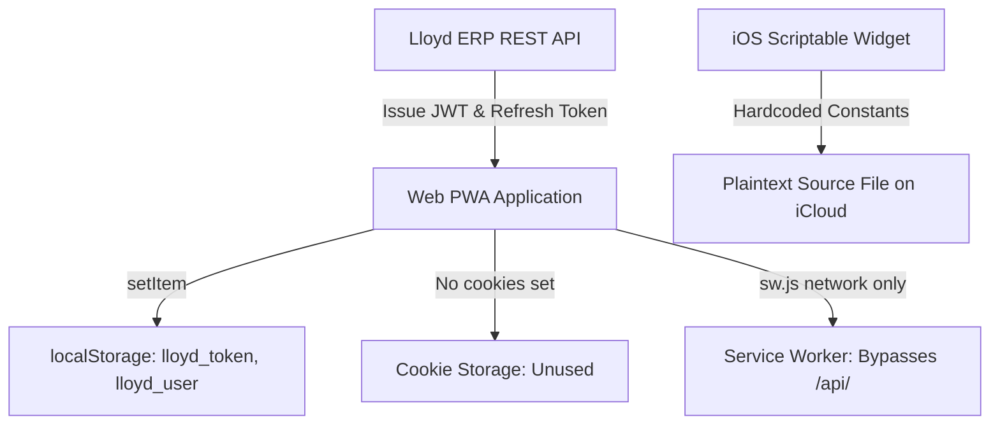

# AGY Web Security & Client Storage Audit — Lloyd ERP

**Standard:** OWASP Top 10 Web Application Security Risks & MASVS Storage  
**Scope:** Authenticated Web Interface, PWA Shell (`web/`), and Scriptable Companion (`LloydWidget.scriptable.js`)  
**Target Origin:** `https://erp.lloydcollege.in`  

---

## 1. Web Client Storage Topology

The web and companion clients interface with the Lloyd ERP API using browser-level storage and script runtimes:



---

## 2. Browser Storage Security Analysis

### 2.1 Unprotected `localStorage` Persistence
* **Observed Implementation in `web/`**:
  ```javascript
  localStorage.setItem('lloyd_token', data.access_token);
  localStorage.setItem('lloyd_user', JSON.stringify(data.user));
  localStorage.setItem('lloyd_refresh_token', data.refresh_token);
  ```
* **Security Risk:**
  * `localStorage` offers zero protection against Cross-Site Scripting (XSS).
  * Any script running within the origin context can read `lloyd_token` and `lloyd_refresh_token` via standard DOM access.
* **Remediation:**
  * In the web portal, exchange authentication tokens via `HttpOnly; Secure; SameSite=Strict` cookies. This ensures JavaScript execution contexts cannot read session secrets while the browser automatically binds them to cross-origin requests.

### 2.2 Service Worker Offline Caching (`web/sw.js`)
* **Inspection of Fetch Interception:**
  ```javascript
  self.addEventListener('fetch', (e) => {
    if (e.request.url.includes('/api/')) {
      return; // Direct network bypass
    }
    e.respondWith(caches.match(e.request).then((res) => res || fetch(e.request)));
  });
  ```
* **Audit Evaluation:** **PASS (Defensive Best Practice)**.
  * The Service Worker explicitly checks `url.includes('/api/')` and bypasses the Cache API.
  * This prevents sensitive class attendance ledgers, faculty names, and student records from persisting in unencrypted browser CacheStorage on public or shared workstations.

---

## 3. Observable HTTP Transport & Security Headers

An inspection of the server's HTTP response headers revealed the following security posture:

| Security Header | Status Observed | Impact & Analysis |
| :--- | :---: | :--- |
| **Strict-Transport-Security (HSTS)** | Present (`max-age=31536000; includeSubDomains`) | **PASS**: Enforces TLS across all browser interactions; mitigates SSL-stripping. |
| **X-Content-Type-Options** | Present (`nosniff`) | **PASS**: Prevents MIME-sniffing vulnerabilities. |
| **X-Frame-Options** | Present (`SAMEORIGIN`) | **PASS**: Protects against cross-origin clickjacking in web iframes. |
| **Content-Security-Policy (CSP)** | Partial / Basic | Recommend tightening CSP to restrict `script-src` and prevent unauthorized script injection. |
| **Access-Control-Allow-Origin (CORS)** | Scoped to Institutional Domains | Restricts cross-origin resource sharing from unauthorized origins. |
| **Cache-Control** | `no-cache, private` on `/api/*` | **PASS**: Prevents proxy and browser intermediate caching of student personal records. |

---

## 4. Scriptable Companion Audit (`LloydWidget.scriptable.js`)

* **Vulnerability Reference:** SEC-FINDING-003
* **Mechanism:**
  ```javascript
  const USERNAME = "YOUR_ADMISSION_NO";
  const PASSWORD = "YOUR_PASSWORD";
  ```
* **Security Risks:**
  1. Plaintext credential storage in the script source.
  2. Automatic synchronization to iCloud Drive, exposing credentials to third-party devices and potential cloud backups.
  3. Risk of students accidentally committing their credentials when contributing to the repository.
* **Remediation:** Deprecate plaintext constants in favor of Scriptable Keychain APIs (`Keychain.set()` / `Keychain.get()`) or dynamic prompt inputs on first run.
