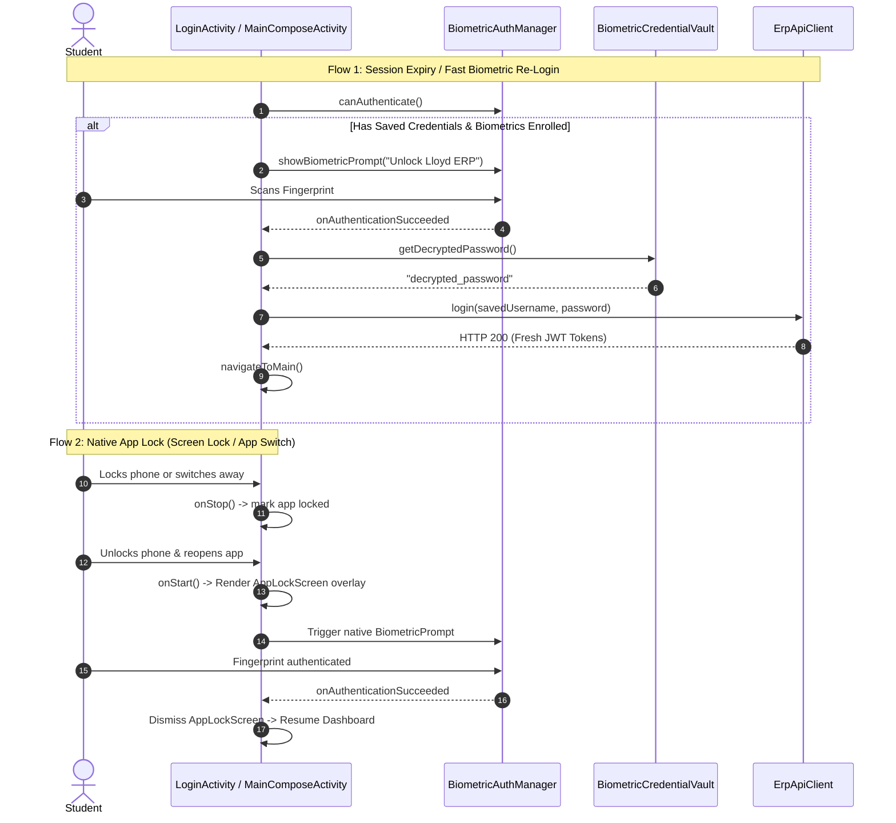

# Native Android Fingerprint Authentication & App Lock Implementation Plan

> **For agentic workers:** REQUIRED SUB-SKILL: Use superpowers:subagent-driven-development (recommended) or superpowers:executing-plans to implement this plan task-by-task. Steps use checkbox (`- [ ]`) syntax for tracking.

**Goal:** Implement hardware-backed credential persistence, native Android `BiometricPrompt` fingerprint authentication for seamless re-login after session expiry, and an automated App Lock experience whenever the device unlocks or the app returns from background.

**Architecture:** 
1. **Hardware Keystore Credential Vault (`BiometricCredentialVault.kt`)**: AES-256-GCM encryption in `AndroidKeyStore` securely persists the student's admission number and password across app sessions and auto-logouts without exposing plain-text credentials.
2. **Native Android Biometric Prompt Manager (`BiometricAuthManager.kt`)**: Leverages `androidx.biometric:biometric` to interface with the device's fingerprint sensor and biometric hardware (`BIOMETRIC_STRONG or DEVICE_CREDENTIAL`), supporting PIN/pattern fallback.
3. **Session Expiry Fast-Unlock (`LoginActivity.kt`)**: When ERP session expires or auto-logout occurs, `LoginActivity` leverages the vault to offer 1-tap/auto fingerprint re-authentication. Scanning fingerprint decrypts the password and executes `apiClient.login()` in the background to restore the session immediately.
4. **App Lock on Device Unlock & Background Return (`MainComposeActivity.kt`)**: Enforces an automated lock screen when the app returns from background or screen-off. An Expressive M3 overlay secures student data until fingerprint verification succeeds.

**Tech Stack:** Kotlin 2.0, Jetpack Compose Material 3 Expressive, `androidx.biometric:biometric:1.2.0-alpha05`, Android Keystore (AES-256-GCM), Android Lifecycle `ProcessLifecycleOwner` / `DefaultLifecycleObserver`, JUnit 4.

**Spec:** `docs/superpowers/plans/2026-10-08-biometric-auth-app-lock.md`

## Global Constraints
- Strictly adhere to `AGENTS.md`: Zero hardcoding of mock credentials, student IDs, or fallback data.
- Hardware Keystore Vault: AES-256-GCM with authenticated tags and random IVs per encryption operation.
- Non-destructive offline handling: If biometric succeeds but device is offline, gracefully inform user with cached data or network retry.
- All unit tests must pass before marking tasks complete (`./gradlew testDebugUnitTest`).

---

## Architecture & Data Flow

---

## File Structure & Responsibilities

| File Path | Responsibility |
|---|---|
| `android/app/build.gradle` | Add `androidx.biometric:biometric:1.2.0-alpha05` and `androidx.fragment:fragment-ktx`. |
| `android/app/src/main/java/com/lloyd/attendance/core/security/BiometricCredentialVault.kt` [NEW] | Hardware-backed keystore vault for AES-256-GCM encrypted persistence of credentials, biometric preferences, and app lock flags. |
| `android/app/src/main/java/com/lloyd/attendance/core/security/BiometricAuthManager.kt` [NEW] | Encapsulates `BiometricManager` checks and `BiometricPrompt` presentation with callbacks. |
| `android/app/src/main/java/com/lloyd/attendance/feature/lock/AppLockScreen.kt` [NEW] | M3 Expressive frosted App Lock UI overlay displayed when device unlocks or returns from background. |
| `android/app/src/main/java/com/lloyd/attendance/ui/LoginActivity.kt` [MODIFY] | Extends `FragmentActivity`, auto-prompts fingerprint on session expiry, and authenticates via saved credentials. |
| `android/app/src/main/java/com/lloyd/attendance/ui/MainComposeActivity.kt` [MODIFY] | Extends `FragmentActivity`, integrates lifecycle-based App Lock detection and unlocks via fingerprint. |
| `android/app/src/main/java/com/lloyd/attendance/feature/profile/ProfileScreen.kt` [MODIFY] | Adds "Biometrics & App Lock" control card (toggle App Lock, forget saved credentials). |
| `android/app/src/test/java/com/lloyd/attendance/core/security/BiometricCredentialVaultTest.kt` [NEW] | Unit tests for credential persistence, encryption/decryption boundaries, and preference toggles. |

---

## Bite-Sized Implementation Tasks

### Task 1: Add Biometric Dependency & Build Verification
**Files:**
- Modify: `android/app/build.gradle:85-88`

- [x] **Step 1: Add `androidx.biometric:biometric:1.2.0-alpha05` to `build.gradle`**
- [x] **Step 2: Sync Gradle and run `./gradlew.bat testDebugUnitTest` to verify classpath resolution**

---

### Task 2: Hardware Keystore Credential Vault (`BiometricCredentialVault.kt`)
**Files:**
- Create: `android/app/src/main/java/com/lloyd/attendance/core/security/BiometricCredentialVault.kt`
- Create: `android/app/src/test/java/com/lloyd/attendance/core/security/BiometricCredentialVaultTest.kt`

**Interfaces:**
- `saveCredentials(username: String, password: String)`
- `getSavedUsername(): String?`
- `getSavedPassword(): String?`
- `hasSavedCredentials(): Boolean`
- `clearCredentials()`
- `isAppLockEnabled(): Boolean`
- `setAppLockEnabled(enabled: Boolean)`

- [x] **Step 1: Write unit tests for `BiometricCredentialVault` logic and state toggles**
- [x] **Step 2: Implement AES-256-GCM Hardware Keystore encryption in `BiometricCredentialVault.kt`**
- [x] **Step 3: Run `./gradlew.bat testDebugUnitTest` to verify test passes**

---

### Task 3: Native Android Biometric Manager (`BiometricAuthManager.kt`)
**Files:**
- Create: `android/app/src/main/java/com/lloyd/attendance/core/security/BiometricAuthManager.kt`

**Interfaces:**
- `canAuthenticate(context: Context): BiometricStatus` (`READY`, `NOT_ENROLLED`, `NO_HARDWARE`, `UNAVAILABLE`)
- `authenticate(activity: FragmentActivity, title: String, subtitle: String, onSuccess: () -> Unit, onError: (String) -> Unit)`

- [x] **Step 1: Implement `BiometricAuthManager.kt` with modern `BiometricPrompt` and `DEVICE_CREDENTIAL` fallback**
- [x] **Step 2: Verify compilation and error handling**

---

### Task 4: Fingerprint Re-Login on Session Expiry (`LoginActivity.kt`)
**Files:**
- Modify: `android/app/src/main/java/com/lloyd/attendance/ui/LoginActivity.kt`
- Modify: `android/app/src/main/java/com/lloyd/attendance/data/AppPreferences.java:220-235`

- [x] **Step 1: Ensure `AppPreferences.logout()` clears active session tokens but preserves saved credentials in `BiometricCredentialVault`**
- [x] **Step 2: Refactor `LoginActivity` to inherit from `FragmentActivity`**
- [x] **Step 3: In `LoginActivity.onCreate()`, if session expired (`AUTH_ERROR`) and credentials exist in vault, display biometric button and prompt fingerprint**
- [x] **Step 4: On fingerprint success, decrypt credentials and call `apiClient.login()` in the background**
- [x] **Step 5: Verify tests and run `./gradlew.bat testDebugUnitTest`**

---

### Task 5: Native App Lock on Device Unlock / App Resume (`AppLockScreen.kt` & `MainComposeActivity.kt`)
**Files:**
- Create: `android/app/src/main/java/com/lloyd/attendance/feature/lock/AppLockScreen.kt`
- Modify: `android/app/src/main/java/com/lloyd/attendance/ui/MainComposeActivity.kt`

- [x] **Step 1: Create `AppLockScreen.kt` with Material 3 Expressive lock screen overlay (avatar, greeting, fingerprint button, sign out option)**
- [x] **Step 2: Refactor `MainComposeActivity` to extend `FragmentActivity`**
- [x] **Step 3: Track lifecycle `onStop` / `onStart` with lock timestamp. If app was backgrounded and `isAppLockEnabled() == true`, set `isAppLocked = true` and auto-trigger `BiometricAuthManager.authenticate()`**
- [x] **Step 4: On authentication success, dismiss `AppLockScreen` immediately**
- [x] **Step 5: Verify app lock behavior and edge cases**

---

### Task 6: Biometrics & App Lock Settings in Profile (`ProfileScreen.kt`)
**Files:**
- Modify: `android/app/src/main/java/com/lloyd/attendance/feature/profile/ProfileScreen.kt`

- [x] **Step 1: Add "Biometrics & App Lock" card in `ProfileScreen.kt`**
- [x] **Step 2: Provide switch to toggle "Unlock with Fingerprint (App Lock)"**
- [x] **Step 3: Provide "Forget Saved Credentials" button with confirmation dialog**
- [x] **Step 4: Verify UI alignment with Material 3 Expressive design system**

---

### Task 7: Full Verification & Automated Regression Testing
- [x] **Step 1: Run `./gradlew.bat testDebugUnitTest`**
- [x] **Step 2: Run `./gradlew.bat assembleDebug` and `./gradlew.bat assembleRelease`**
- [x] **Step 3: Verify APK generation and create walkthrough summary**
